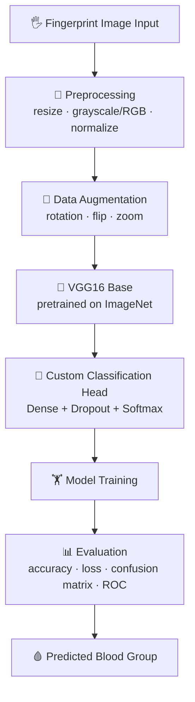

<div align="center">


# 🩸 Blood Group Prediction Using Fingerprint Images
### Deep Learning · Computer Vision · Transfer Learning (VGG16)


<p>
  <a href="#-overview">Overview</a> •
  <a href="#-workflow">Workflow</a> •
  <a href="#-installation">Installation</a> •
  <a href="#-results">Results</a> •
  <a href="#-author">Author</a>
</p>

</div>

---

## 📌 Overview

**Blood Group Prediction Using Fingerprint Images** is a deep learning system that classifies a person's blood group directly from a fingerprint image, using **transfer learning on the VGG16 convolutional neural network**.

Fingerprint patterns (ridges, loops, whorls) are believed to correlate with certain biological traits. This project explores whether a CNN can learn discriminative features from fingerprint scans to predict one of eight blood group classes — offering a fast, low-cost, non-invasive alternative to lab-based blood typing.

<table>
<tr>
<td width="25%" align="center">🧠<br><b>Transfer Learning</b><br><sub>Pretrained VGG16 backbone</sub></td>
<td width="25%" align="center">📷<br><b>Image Preprocessing</b><br><sub>Resize · normalize · augment</sub></td>
<td width="25%" align="center">🎯<br><b>8-Class Classification</b><br><sub>A+, A−, B+, B−, AB+, AB−, O+, O−</sub></td>
<td width="25%" align="center">📊<br><b>Full Evaluation Suite</b><br><sub>Accuracy, loss, confusion matrix, ROC</sub></td>
</tr>
</table>

---

## 📂 Project Structure

```
Blood-Group-Prediction-Using-Fingerprint-Images/
│
├── Blood_Group_VGG16_Improved.ipynb     # Main notebook: training + evaluation
├── README.md
├── requirements.txt
├── LICENSE
├── .gitignore
│
├── images/
│   └── banner.png                        # Project banner (this repo's cover)
│
└── outputs/                               # Generated result plots (see below)
    ├── accuracy.png
    ├── loss.png
    ├── confusion_matrix.png
    ├── roc_curve.png
    └── sample_prediction.png
```

---

## 🏥 Dataset

Fingerprint images labeled across **8 blood group classes**:

| Class | A+ | A− | B+ | B− | AB+ | AB− | O+ | O− |
|:-----:|:--:|:--:|:--:|:--:|:---:|:---:|:--:|:--:|
| Type  | ✅ | ✅ | ✅ | ✅ | ✅  | ✅  | ✅ | ✅ |

> Update this section with your dataset's actual source, size, and license/citation if it is public (e.g. Kaggle).

---

## ⚙ Workflow



> GitHub renders Mermaid diagrams natively in the README — no image needed. If you'd rather use a static image, export this diagram as `images/workflow.png` and swap the block above for ``.

---

## 🧠 Model Architecture

```
Input (224x224x3)
      │
      ▼
VGG16 Convolutional Base (pretrained, frozen / fine-tuned)
      │
      ▼
GlobalAveragePooling2D
      │
      ▼
Dense(256, activation='relu')
      │
      ▼
Dropout(0.4)
      │
      ▼
Dense(8, activation='softmax')  →  Blood Group Prediction
```

---

## 🛠 Tech Stack

| Category | Tools |
|---|---|
| Language | Python 3.10 |
| Deep Learning | TensorFlow, Keras |
| Computer Vision | OpenCV |
| Data Handling | NumPy, Pandas |
| Visualization | Matplotlib, Seaborn |
| Evaluation | Scikit-learn |

---

## 🚀 Installation

```bash
# 1. Clone the repository
git clone https://github.com/deepika8048/Blood-Group-Prediction-Using-Fingerprint-Images.git
cd Blood-Group-Prediction-Using-Fingerprint-Images

# 2. Install dependencies
pip install -r requirements.txt

# 3. Launch Jupyter Notebook
jupyter notebook Blood_Group_VGG16_Improved.ipynb
```

Run all cells in the notebook to train the model and reproduce the results below.

---

## 📈 Results

> These images are generated **by your notebook**, not invented — add a final cell (snippet below) so every run automatically saves fresh plots into `outputs/`, then commit those PNGs to your repo. Once they exist at the paths below, GitHub will display them automatically.

<table>
<tr>
<td align="center" width="50%"><b>Training Accuracy</b><br></td>
<td align="center" width="50%"><b>Training Loss</b><br></td>
</tr>
<tr>
<td align="center" width="50%"><b>Confusion Matrix</b><br></td>
<td align="center" width="50%"><b>ROC Curve</b><br></td>
</tr>
</table>

<div align="center">

<p><i>Sample prediction on a test fingerprint image</i></p>
</div>

### 🔧 Add this cell to the end of your notebook to generate these plots

```python
import os, itertools
import numpy as np
import matplotlib.pyplot as plt
from sklearn.metrics import confusion_matrix, roc_curve, auc
from sklearn.preprocessing import label_binarize

os.makedirs("outputs", exist_ok=True)
class_names = ["A+", "A-", "B+", "B-", "AB+", "AB-", "O+", "O-"]

# --- Accuracy curve ---
plt.figure(figsize=(7,5))
plt.plot(history.history['accuracy'], label='Train Accuracy')
plt.plot(history.history['val_accuracy'], label='Val Accuracy')
plt.title('Model Accuracy'); plt.xlabel('Epoch'); plt.ylabel('Accuracy'); plt.legend()
plt.tight_layout(); plt.savefig("outputs/accuracy.png", dpi=200); plt.close()

# --- Loss curve ---
plt.figure(figsize=(7,5))
plt.plot(history.history['loss'], label='Train Loss')
plt.plot(history.history['val_loss'], label='Val Loss')
plt.title('Model Loss'); plt.xlabel('Epoch'); plt.ylabel('Loss'); plt.legend()
plt.tight_layout(); plt.savefig("outputs/loss.png", dpi=200); plt.close()

# --- Confusion matrix ---
y_pred = np.argmax(model.predict(X_test), axis=1)
y_true = np.argmax(y_test, axis=1)
cm = confusion_matrix(y_true, y_pred)
plt.figure(figsize=(7,6))
plt.imshow(cm, cmap='Blues')
plt.title('Confusion Matrix'); plt.colorbar()
plt.xticks(range(len(class_names)), class_names, rotation=45)
plt.yticks(range(len(class_names)), class_names)
for i, j in itertools.product(range(cm.shape[0]), range(cm.shape[1])):
    plt.text(j, i, cm[i, j], ha="center", va="center",
              color="white" if cm[i, j] > cm.max()/2 else "black")
plt.ylabel('True label'); plt.xlabel('Predicted label')
plt.tight_layout(); plt.savefig("outputs/confusion_matrix.png", dpi=200); plt.close()

# --- ROC curve (multi-class, one-vs-rest) ---
y_test_bin = label_binarize(y_true, classes=range(len(class_names)))
y_score = model.predict(X_test)
plt.figure(figsize=(7,6))
for i, name in enumerate(class_names):
    fpr, tpr, _ = roc_curve(y_test_bin[:, i], y_score[:, i])
    plt.plot(fpr, tpr, label=f"{name} (AUC = {auc(fpr, tpr):.2f})")
plt.plot([0,1],[0,1],'k--', linewidth=1)
plt.title('ROC Curve — One-vs-Rest'); plt.xlabel('False Positive Rate'); plt.ylabel('True Positive Rate')
plt.legend(fontsize=8); plt.tight_layout()
plt.savefig("outputs/roc_curve.png", dpi=200); plt.close()

print("✅ All result plots saved to outputs/")
```

Then, from your terminal:

```bash
git add outputs/*.png
git commit -m "Add result plots"
git push
```

---

## 💡 Future Enhancements

- 📱 Deploy as a mobile app (TensorFlow Lite)
- 🌐 Build a web-based prediction interface (Flask / Streamlit)
- 🔍 Add Explainable AI (Grad-CAM heatmaps) to visualize what the model focuses on
- 📚 Expand dataset size and diversity
- 🏗️ Benchmark against EfficientNet / ResNet backbones
- ⚡ Real-time prediction via webcam/scanner input

---

## 👩‍💻 Author

<div align="center">

### Deepika Patel
🎓 B.Tech — Computer Science Engineering

[](mailto:deepikap020@gmail.com)
[](https://github.com/deepika8048)
[](https://www.linkedin.com/in/deepika-patel-84132a1bb/)

</div>

---

<div align="center">

### ⭐ If this project helped you, consider giving it a star!

</div>
